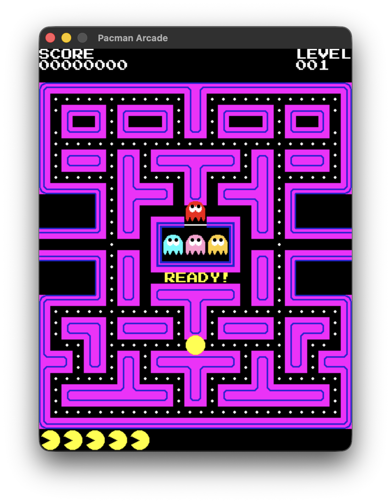
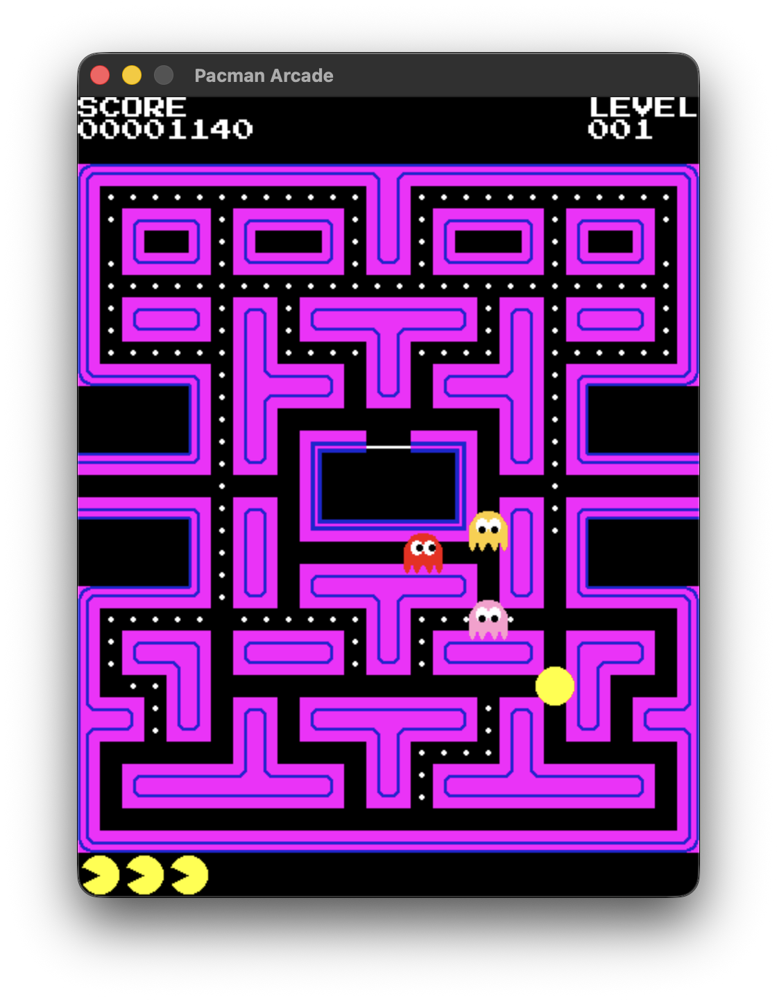

# Pacman

Dieses Projekt ist ein Schulprojekt für Softwareentwicklung (SEW) und wurde als Abschlussarbeit in einer 2er-Gruppe entwickelt.

Es handelt sich um eine Nachbildung des Arcade-Klassikers _Pacman_ in Python mit Pygame. Ziel des Projekts war die praktische Anwendung von objektorientierter Programmierung, Graphen-basierter Wegfindung und Geister-KI.

## Screenshots

|                      Hauptmenü                       |                     Gameplay                      |
| :--------------------------------------------------: | :-----------------------------------------------: |
|  |  |

## Projektstruktur

- [`main.py`](file:///Users/metiny/Desktop/github/pacman/main.py) – Hauptspielschleife und Game-Controller
- [`game_config.py`](file:///Users/metiny/Desktop/github/pacman/game_config.py) – Globale Konfigurationen, Dimensionen und Enums
- [`math_vec.py`](file:///Users/metiny/Desktop/github/pacman/math_vec.py) – 2D-Vektormathematik und Distanzberechnungen
- [`actor.py`](file:///Users/metiny/Desktop/github/pacman/actor.py) – Basisklasse für alle beweglichen Labyrinth-Akteure
- [`player.py`](file:///Users/metiny/Desktop/github/pacman/player.py) – Spieler-Charakter (Pacman) mit Tastensteuerung und Kollisionen
- [`ghost_actors.py`](file:///Users/metiny/Desktop/github/pacman/ghost_actors.py) – Geister-Akteure mit individueller Ziel-KI
- [`ghost_state_machine.py`](file:///Users/metiny/Desktop/github/pacman/ghost_state_machine.py) – Zustandsautomat für Scatter-, Chase-, Freight- & Spawn-Modus
- [`collectibles.py`](file:///Users/metiny/Desktop/github/pacman/collectibles.py) – Punkte-Pellets und Power-Pellets (Energizer)
- [`bonus_fruit.py`](file:///Users/metiny/Desktop/github/pacman/bonus_fruit.py) – Zeitlich begrenzte Bonusfrüchte
- [`nav_grid.py`](file:///Users/metiny/Desktop/github/pacman/nav_grid.py) – Wegpunktgraphen, Kreuzungsknoten und Portale
- [`level_maps.py`](file:///Users/metiny/Desktop/github/pacman/level_maps.py) – Map-Konfigurationen und Level-Layouts
- [`graphics_engine.py`](file:///Users/metiny/Desktop/github/pacman/graphics_engine.py) – Spritesheet-Slicing, Animationen und Labyrinth-Rendering
- [`animator.py`](file:///Users/metiny/Desktop/github/pacman/animator.py) – Frame-basierte Animationssteuerung
- [`pause_manager.py`](file:///Users/metiny/Desktop/github/pacman/pause_manager.py) – Manuelle Pausen und zeitgesteuerte Delays
- [`ui_overlay.py`](file:///Users/metiny/Desktop/github/pacman/ui_overlay.py) – HUD-Overlay, Punktestand und Textanzeigen

## Steuerung

- **W / A / S / D** oder **Pfeiltasten**: Pacman steuern
- **Leertaste**: Spiel pausieren / fortsetzen

## Ausführen

```bash
python3 main.py
```
